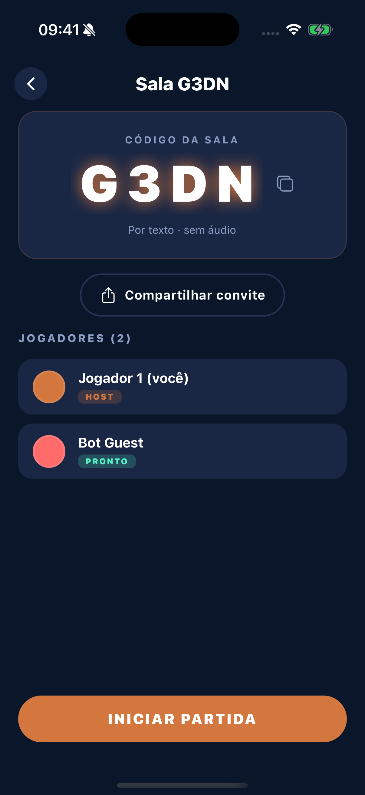
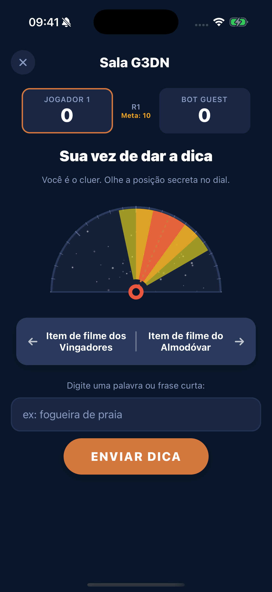

<div align="center">


# Sintonia

**A party game about reading other people's minds — around a table or across the internet.**

[](https://apps.apple.com/app/id6762064623)
[](https://play.google.com/store/apps/details?id=com.bruno.wavelength)
[](https://sintonia.party)
&nbsp;


[How it works](#-how-it-works) &nbsp;·&nbsp; [Structure](#-structure) &nbsp;·&nbsp; [Running it](#-running-it) &nbsp;·&nbsp; [Details worth a look](#-details-worth-a-look)

</div>

---

One player sees a hidden target on a spectrum — *Avengers movie prop* ↔ *Almodóvar movie prop* — and gives a one-word clue. Everyone else guesses where on the dial that clue lands. The closer they get, the more points.

<div align="center">

&nbsp;&nbsp;

</div>

## 🧠 How it works

The rules live in exactly one place. `packages/game-core` is a pure reducer — no I/O, no framework — and the three runtimes all read from it:

```
                      ┌──────────────────────────┐
                      │  packages/game-core      │
                      │  pure reducer + protocol │
                      └────────────┬─────────────┘
                 ┌─────────────────┼─────────────────┐
                 ▼                 ▼                 ▼
          apps/mobile        apps/backend        apps/web
          Expo Router     Durable Object (WS)    Next.js
          renders state    owns the truth        landing + /join
```

**Offline** the app runs the reducer itself and passes the phone around.
**Online** the same reducer runs inside a Durable Object, one per room, and the app becomes a renderer: it sends intents over a WebSocket and draws whatever state comes back.

That split is the whole design. The server never trusts a client with the hidden target, and the client never has to reimplement a rule to stay in sync — because it is running the same function.

## 📁 Structure

| | |
|---|---|
| [`packages/game-core`](./packages/game-core) | Reducer, scoring, spectrum picker, wire protocol. Zero dependencies. |
| [`apps/mobile`](./apps/mobile) | Expo Router app, iOS and Android. Reanimated dial, i18n in 3 languages. |
| [`apps/backend`](./apps/backend) | PartyServer on Cloudflare Workers. One Durable Object per room. |
| [`apps/web`](./apps/web) | Next.js landing page and the `/join/[code]` deep link target. |

## 🚀 Running it

```bash
pnpm install
pnpm dev:backend   # room server on :1999
pnpm dev:mobile    # Expo
pnpm dev:web       # Next.js
```

To play a full online round without four friends, the server ships a bot:

```bash
cd apps/backend
node scripts/bot.mjs ABCD "Bot 1"                      # a guest
node scripts/bot.mjs ABCD "Bot 2" host text single     # a host that starts the game
```

## 🔍 Details worth a look

**Room codes skip `I`, `O`, `0` and `1`.** The code gets read out loud across a noisy room, so the alphabet drops every character that gets misheard.

**The host can drop without killing the room.** A disconnect starts a grace timer rather than closing immediately — hosts walk through dead spots, and ten seconds of patience is cheaper than ending everyone's game.

**Reconnects keep your seat.** The client carries a persistent player id, so the server treats a returning socket as the same player rather than a new one. Backoff climbs to 8s and then keeps retrying, because the usual causes — a deploy, a wifi blip, a backgrounded app — clear on their own.

**The server decides, the client animates.** Every phase transition comes from the Durable Object. The app has no authority to advance a round, which is why two clients can't disagree about whose turn it is.

<div align="center">
<br />
<sub>Built by <a href="https://github.com/brunozampirom">Bruno Zampirom</a></sub>
</div>
